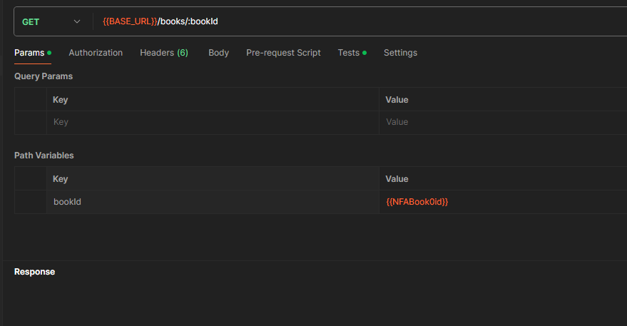

{{BASE_URL}}/books/:bookId

pm.test("Status code is 200", function () {
    pm.response.to.have.status(200);
});

pm.test("Stock is positive", ()=>{
    pm.expect(pm.response.json()['current-stock']).to.be.greaterThan(0);
})

//as the bookId is selected to be available, I will check is the stock grather than 0

{
    "id": 5,
    "name": "Untamed",
    "author": "Glennon Doyle",
    "type": "non-fiction",
    "price": 15.5,
    "current-stock": 20,
    "available": true
}