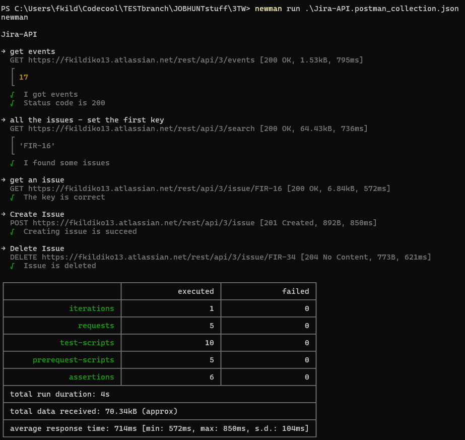
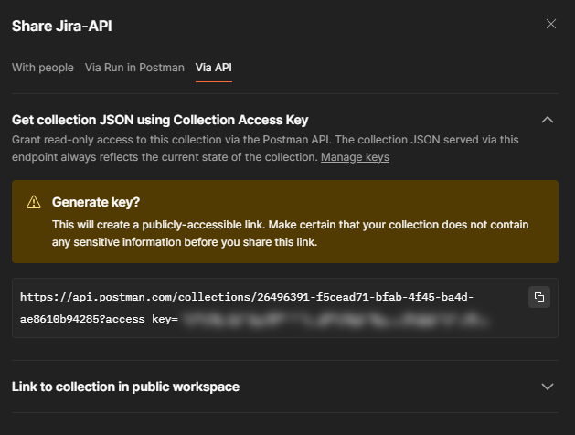
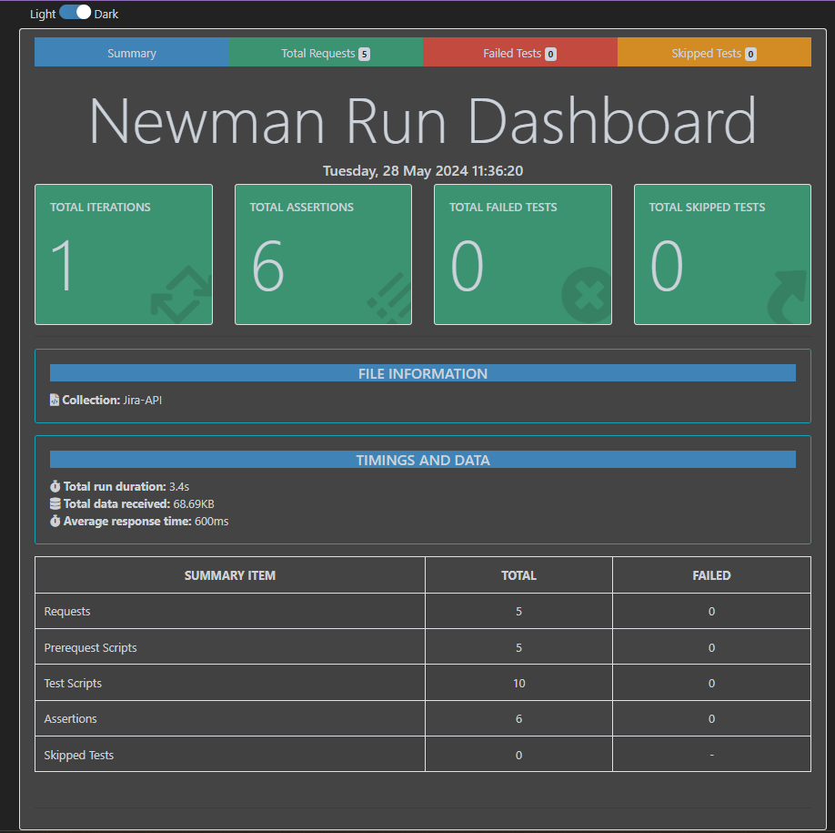
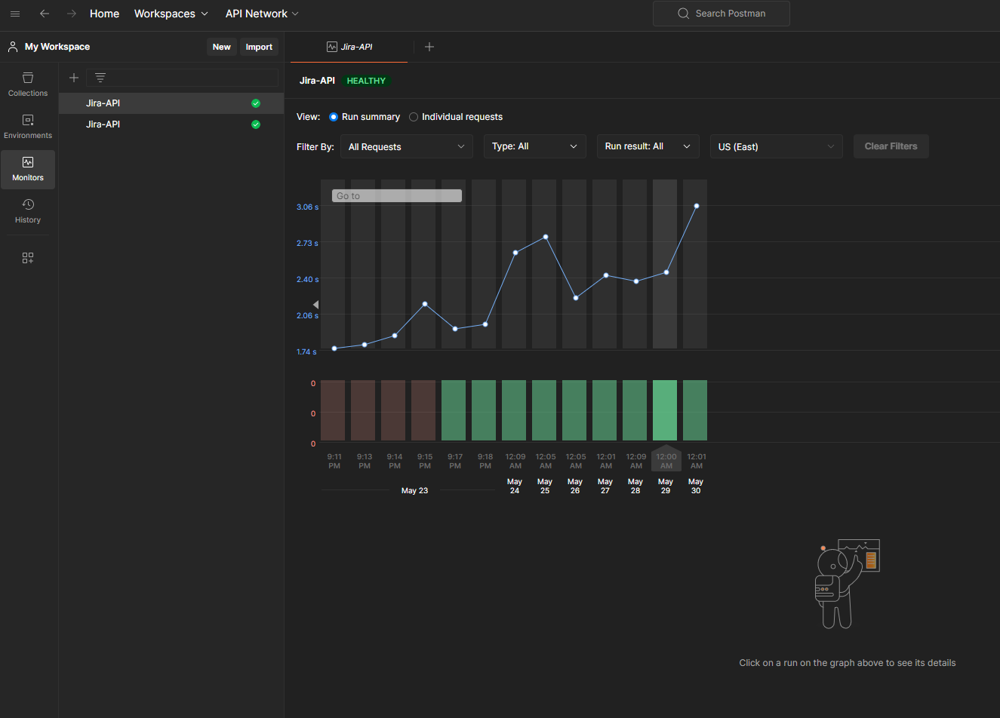
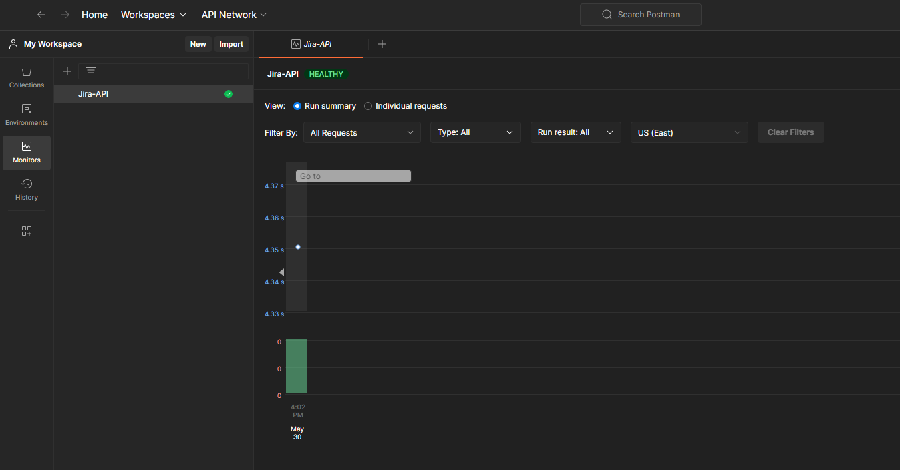

**Newman is a command-line Collection Runner for Postman.**
It enables you to run and test a Postman Collection directly from the command line. It's built with extensibility in mind so that you can integrate it with your continuous integration (CI) servers and build systems.

install newmnan with
`` npm install -g newman@latest``

in Postman export the collection.

open terminal in folder with the .json file(where you exported the collection)

run the newman:

`` newman run <name_of_collection>.json``

U can use a public link to run your test. Share your Collection :

run with:
`` newman run  https://api.postman.com/collections/<secret>?access_key=<acces key>``

Reports:

install reporter with:
`` npm install -g newman-reporter-htmlextra``

to run and get the report in html:
``  newman run <name_of_collection>.json -r htmlextra``

This command will create a new report in the ./newman directory, if the directory does not exist, it will be created as part of the Newman run.

U can find more information [here](https://www.npmjs.com/package/newman-reporter-htmlextra).

I cannot add a Postman collection file to a public repository. I have placed it in a private repository and will run tests from there.
I removed all sensitive data from the collection file, and I'm posting it here.

The older version of Collection runs in Monitors

Nem new expanded collection will run every Monday at 9 AM.

