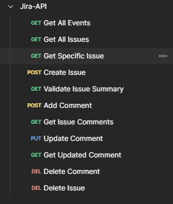
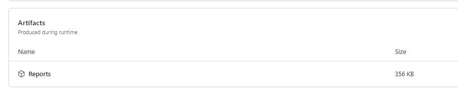
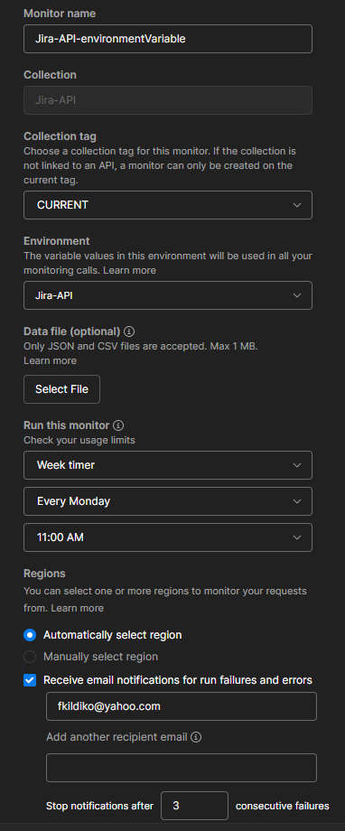
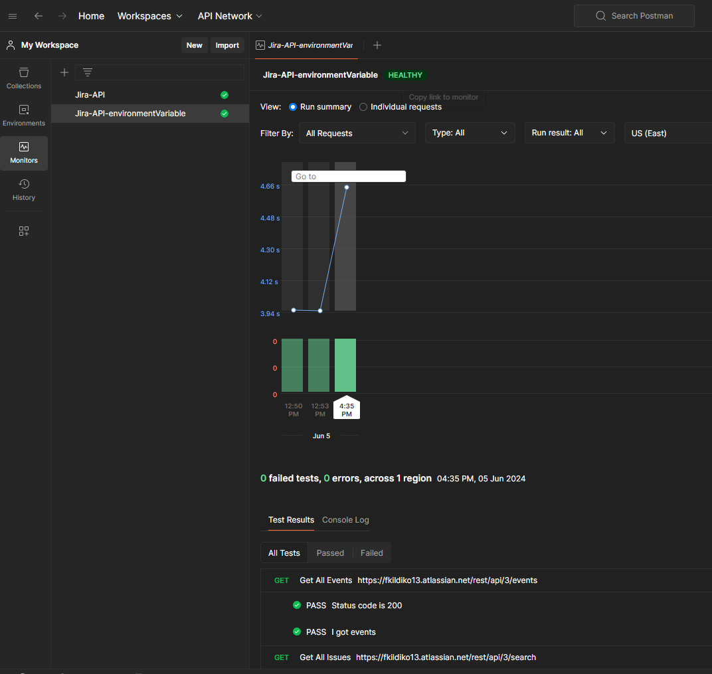

This project was created by Földi Krizsán Ildikó. Feel free to check out my GitHub account or my LinkedIn page:

  

## About The Project

This project automates some functional tests for my Jira account's API. These tests are written in Postman and run on every push or pull request to the main branch of this repository. I also set up monitoring, so all the tests will be executed every Monday.

## Built With

  
  
  

### Why Is API testing important?

API testing is crucial for ensuring a smooth-running application because Application Programming Interfaces, are the backbone of communication between different software components. By testing APIs, you can identify bugs and errors early in the development process, before they cause problems in the final product. This saves time and money compared to fixing issues later on.

### Why Postman?

 

Postman is one of the most popular software applications for API testing. It boasts a user-friendly interface, making it easy to learn and use. Postman supports various testing types, including functional, regression, performance, and security testing.

A key feature of Postman is the ability to organize APIs into collections for better reusability and manageability.  Postman also excels in automated testing. You can create test scripts using JavaScript, a popular and versatile scripting language. Additionally, Postman integrates seamlessly with CI/CD pipelines, enabling automated testing as part of your development workflow.

Finally, Postman simplifies API response validation by allowing you to verify data, status codes, and headers. It even provides monitoring capabilities to track API performance and uptime, ensuring your APIs remain reliable and efficient.

### Why Testing Jira API?

 

Jira, a widely used proprietary issue tracking and project management tool for software development teams, was my choice for testing.  Understanding any system through testing is valuable, and Jira's functionalities provided a perfect platform to gain those insights.

### Details of project

I used Jira REST API v3 and the base url I stored in collection variable. For authentication I used username and a token as a password. These are stored as global variables and they are secrets.
I have a GET request for all the events of account, in tests i check if response have more than 0 events, and check of status code.
Next is GET request for all the issues of the account. I am testing the status code, and that I got any issue. The first issue's key is setted as a collection variable, to be able to use it for next request.
I request the specify issue, based on previous resposne. After testing is the status code 200, I check if I got the issue I asked for.
Next is POST request, I create an issue, with only required fields. The tests are for checking the status code (201), and to store the key of issue as collection variable.
In next step I validate that the created issue has the summary field as I send. 
Using POST request I add the comment to issue. Validating the status code(201) and the correctness of comment.
After sending GET request for the comments of issue, I check the status code, and that I have only one comment. If it is correct, I store the key of comment as colection variable, for further usage.
Using the key of comment, I change the comment with PUT request. With test I check the status code, and that the comment text has changed to new.
With GET request of comment we validate the changes.
Last two requests are deleting the comment, and deleting the issue we created and used only for testing purposes.

I used Jira REST API v3 and I stored the base URL in a collection variable. For authentication, I employed a username and a password (token) stored as secure environment variables.

My tests utilize several GET, POST, PUT and DELETE requests:

1. Get All Events: This request retrieves all account events. The tests verify the response contains at least one event and has a successful status code.
2. Get All Issues: This request retrieves all account issues. The tests check for a successful status code and the presence of at least one issue. The key of the first issue is stored in a collection variable for later use.
3. Get Specific Issue: Based on the previous response, this request retrieves a specific issue. Tests ensure a 200 status code and that the retrieved issue matches the requested one.
4. Create Issue: This request creates a new issue with only required fields. Tests verify a 201 status code (Created) and store the created issue's key in a collection variable.
5. Validate Issue Summary: This step ensures the newly created issue has the expected summary field value.
6. Add Comment: A comment is added to the issue using a POST request. Tests confirm a 201 status code and the correctness of the comment content.
7. Get Issue Comments: This request retrieves all comments for the issue. Tests validate the status code and ensure there's only one comment. If successful, the comment key is stored in a collection variable.
8. Update Comment: Using the comment key, a PUT request modifies the comment content. Tests verify the status code and that the comment text reflects the changes.
9. Get Updated Comment: This GET request confirms the comment content has been updated as expected.
10. Delete Comment: The comment created for testing purposes is deleted.
11. Delete Test Issue: Finally, the issue created solely for testing is deleted.

 
 

#### Run is in pipeline

To run the Postman API tests within my GitHub Actions pipeline, I leverage Newman, a command-line collection runner for Postman. I exported my collection as a JSON file, but due to security concerns, I opted to store it in a separate private repository.

Within the YAML file of this private repository, I can securely access the private repository using a token and execute the tests from there. Additionally, I've stored a version of the JSON file (stripped of sensitive data and replaced with "?") within this public repository for informational purposes.

Test reports are generated and placed in the "Reports" folder. You can download these reports from the workflow's artifacts.

 
 

 
 

#### Setting up monitoring

I've configured monitoring for these API endpoints. The monitoring will execute all the tests every Monday and send email notifications if any tests fail.

 
 
 
