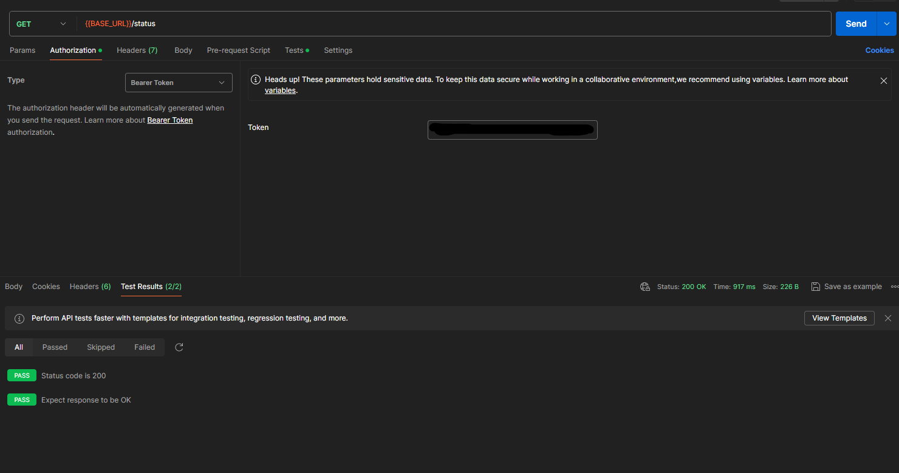

```
GET {{BASE_URL}}/status

test:
pm.test("Status code is 200", function () {
    pm.response.to.have.status(200);
});

const resp = pm.response.json();

console.log(resp);
console.log(resp.status);

pm.test("Expect response to be OK", ()=>{
    pm.expect(resp.status).to.eql("OK");
})

response:
{
    "status": "OK"
}
```
